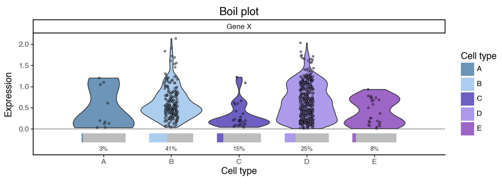
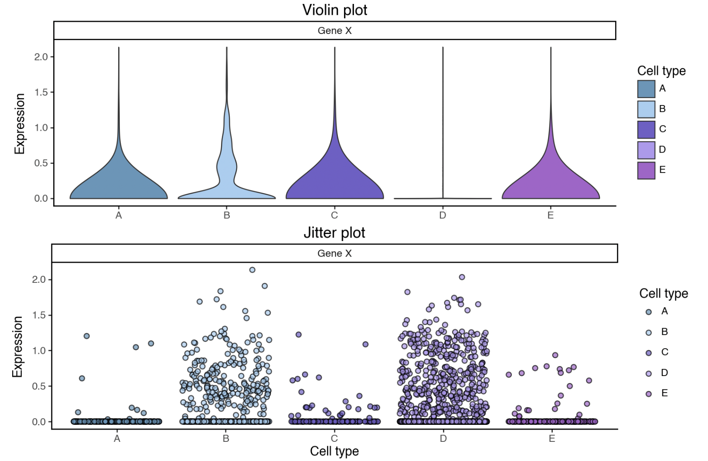

# BoilPlot



A Python utility for faithful and interpretable visualisations of zero-inflated distributions (typical for single-cell gene expressions) stored in an [**`AnnData`**](https://anndata.readthedocs.io/) object.

(An R implementation is currently in development.)

## Description

Single-cell expression data is typically dominated by zeros. This makes conventional distribution plots often difficult to read, and sometimes downright misleading.

Identical real-life data is shown on the two plots below, but they would lead us towards wildly different interpretations. This is an artifact of violin plots scaling, which struggles to capture the full distribution in these conditions, and gives an impression that is pretty much the opposite of the ground truth. Alternative scaling approaches result in violins that are no longer violins, but rather upside down 'T's, and thus completely illegible.

Jitter plots capture the ground more faithfully, but are difficult to interpret in relation to cluster sizes. The example plot below doesn't allow us to notice that gene X is expressed in a higher proportion of cells B than D.



There are really two pieces of information:

-   How many cells express the gene?

-   What is the expression distribution among those cells?

Boil plots visually separate the two, resulting in more faithful and interpretable visual representations. (A similar separation is already widely adopted in dot plot marker visualisations of single-cell data.)


## Getting Started

### Installation

The package can be installed directly from GitHub:

```         
pip install git+https://github.com/laraj1/boilplot-python.git
```

The required dependencies are installed automatically.

### Example

```         
import scanpy as sc

from boilplot import boil_plot

adata = sc.datasets.pbmc3k_processed()
p = boil_plot(
    adata,
    genes=["CST3", "NKG7", "PPBP"],
    category_col="louvain",
    min_nonzero=10,
)
p.show()
```

## API

### `boil_plot()`

| Parameter | Type | Default | Description |
|------------------|------------------|------------------|------------------|
| `adata` | `AnnData` | — | AnnData object containing expression data. |
| `genes` | `str` or `list[str]` | — | Gene or genes to plot. |
| `category_col` | `str` | — | Column in `adata.obs` containing the categories to compare. |
| `palette` | `dict` or `None` | `None` | Mapping of category names to colours. If `None`, colours are generated automatically. |
| `category_order` | `list` or `None` | `None` | Optional explicit order of categories on the x-axis. |
| `min_nonzero` | `int` | `10` | Minimum number of non-zero observations required for a violin to be shown for a gene/category combination. |
| `layer` | `str` or `None` | `None` | AnnData layer from which to extract expression. If `None`, `adata.X` is used. |
| `use_raw` | `bool` | `False` | If `True`, expression is extracted from `adata.raw`. |
| `title` | `str` or `None` | `None` | Optional plot title. |
| `point_size` | `float` | `0.7` | Size of jittered points. |
| `point_alpha` | `float` | `0.6` | Transparency of jittered points. |
| `jitter_width` | `float` | `0.1` | Horizontal jitter applied to strip plot points. |

### Returns

`plotnine.ggplot`

A plotnine `ggplot` object containing the resulting visualisation.

### Visualisation components

| Component | Represents |
|------------------------------------|------------------------------------|
| Violin | Distribution of non-zero expression values. |
| Jittered points | Individual non-zero observations. |
| Grey bar | Full range corresponding to 100% of observations. |
| Coloured bar | Proportion of observations with non-zero expression. |
| Percentage label | Exact proportion of observations with non-zero expression. |

## Authors

[Lara Jerman](https://www.linkedin.com/in/larajerman/)

## Version History

-   0.1.0
    -   Initial Release

## License

This project is licensed under the MIT License.
